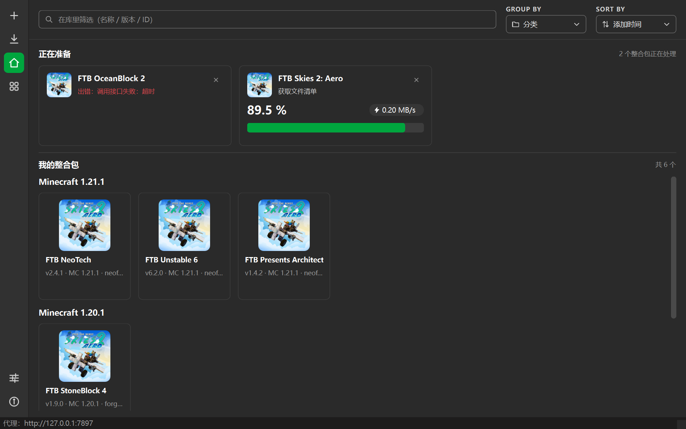

# FTB 整合包下载器（PySide6）

输入整合包 ID → 选版本 → 选客户端/服务端 + 标准包/完整包 → 下载并打成能直接导入启动器的
CurseForge 格式整合包 zip。数据源是 FTB 官方接口（feed-the-beast.com）。

界面照着**官方 FTB App** 做：左侧图标栏 + 搜索 / GROUP BY / SORT BY + 卡片列表，深色主题。



> **参考项目**：`reference/CTBModifiy-master/`（C# 写的 CurseTheBeast，2024 年后没再更新）。
> 该目录已加进 `.gitignore`，只作为**只读参考**：接口怎么调、字段怎么解析、zip 怎么打，全部照它来。
> 参考项目踩过的坑（尤其是会让整份清单解析失败的字段类型问题）记在 [`docs/ftb-api-notes.md`](docs/ftb-api-notes.md)。

## 环境与运行（uv）

包管理用 [uv](https://docs.astral.sh/uv/)，依赖写在 `pyproject.toml`，锁定在 `uv.lock`（跟着仓库走）。

```powershell
uv sync                                    # 建 .venv + 按 uv.lock 装依赖
uv run main.py                             # 启动 GUI
uv run ruff check .                        # 代码检查
uv add <包名>                              # 加依赖（别手改 requirements）
uv run python scripts\smoke_ftb_api.py     # 命令行冒烟：不弹窗，直接跑一遍 FTB 接口
```

需要走代理时给 uv 带上环境变量（uv 认 `HTTP_PROXY` / `HTTPS_PROXY`）：

```powershell
$env:HTTPS_PROXY='http://127.0.0.1:7897'; $env:HTTP_PROXY='http://127.0.0.1:7897'
uv sync
```

## 目录结构

```
FTB_downloader/
├── pyproject.toml / uv.lock / .python-version   # uv 工程
├── main.py                      # 入口
├── scripts/smoke_ftb_api.py     # 命令行冒烟
├── docs/
│   ├── ftb-api-notes.md         # FTB / CurseForge 接口与打包格式笔记
│   ├── ui-notes.md              # 配色取样 + 界面结构对照
│   └── ui-preview.png           # 界面预览图（脚本生成）
├── src/ftb_downloader/
│   ├── app.py                   # QApplication 引导（--self-test 无头自检）
│   ├── net.py                   # 代理探测（系统代理 → 环境变量）
│   ├── util.py
│   ├── api/                     # ftb.py / curseforge.py
│   ├── models/                  # manifest.py（含字符串 ID 兼容）/ pack.py
│   ├── services/                # library.py（本地库）/ tasks.py（后台线程）
│   └── ui/
│       ├── theme.py             # 配色 + 样式表 + QPalette
│       ├── icons.py             # QPainter 现画的线性图标
│       ├── layouts.py           # FlowLayout（卡片自动换行）
│       ├── image_cache.py       # 封面的异步加载 + 缓存
│       ├── main_window.py       # 主窗口骨架
│       ├── widgets/             # sidebar / topbar / cards / common
│       └── pages/               # library / discover / downloads / settings / about
└── reference/                   # ← git 忽略，参考项目副本
    └── CTBModifiy-master/
```

## 界面结构（对照 FTB App）

| 位置 | 内容 | 参考实现 |
| --- | --- | --- |
| 左侧栏 | ＋添加 / 下载 / 我的整合包 / 发现 / 设置 / 关于，选中项绿底 | `ui/widgets/sidebar.py` |
| 顶栏 | 搜索框 + GROUP BY（分类 / 状态 / 名称）+ SORT BY（添加时间 / 名称 / 体积） | `ui/widgets/topbar.py` |
| 正在准备 | 大卡片：封面 + 名称 + 状态 + 百分比 + 进度条 + ⚡速度 | `ui/widgets/cards.py:PackCard` |
| 我的整合包 | 网格卡片，按 MC 版本分组，右键移除 | `ui/widgets/cards.py:PackTile` |
| 底部状态栏 | 当前动作 / 代理 | `ui/main_window.py` |

配色是从 FTB App 截图里逐像素取样出来的，见 [`docs/ui-notes.md`](docs/ui-notes.md)。

## 当前进度

已经能跑通的：

- **界面**：FTB App 风格的深色 UI（自绘图标、下拉框、进度条、卡片，零图片资源）
- **FTB 接口**：整合包信息 / 版本列表 / 文件清单（8 MB 清单流式下载，卡片上显示真实进度和速度）
- **本地库**：加过的整合包会存到 `%LOCALAPPDATA%\FTBDownloader\library.json`，重启还在
- **发现页**：搜关键词，或直接输入纯数字 ID 添加；热门整合包一键加入
- **代理**：自动读 Windows 系统代理，设置页可重新探测

还没写（下一步按参考项目补）：

| 待做 | 参考项目文件 |
| --- | --- |
| 下载队列：多线程、缓存、sha1 校验（卡片上的进度就接这里） | `Services/FileDownloadService.cs`、`Download/DownloadQueue.cs` |
| CurseForge fileId 有效性校验（sha1 对不上就改成自己下载） | `Services/CurseforgeService.cs` |
| 打包成 CurseForge zip（`manifest.json` / `overrides/` / `modlist.html` / 注释 / 图标） | `Packs/CurseforgeModpackExtensions.cs`、`Services/PackService.cs` |
| 服务端包 + loader 预安装（Forge / NeoForge / Fabric） | `Packs/ServerModpack.cs`、`ServerInstaller/*` |
| 失效文件恢复（`/mod/{sha1}` 重新找源） | `FTBService.TryRecoverUnreachableFiles` |

## 参考项目对照表

| 参考项目（C#） | 本项目（Python） |
| --- | --- |
| `Api/FTB/FTBApiClient.cs` | `src/ftb_downloader/api/ftb.py` |
| `Api/FTB/Model/ModpackManifest.cs` | `src/ftb_downloader/models/manifest.py` |
| `Api/FTB/Model/ModpackInfo.cs` | `src/ftb_downloader/models/pack.py` |
| `Api/Curseforge/CurseforgeApiClient.cs` | `src/ftb_downloader/api/curseforge.py` |
| `Services/HttpConfigService.cs` | `src/ftb_downloader/net.py` |
| `Services/FTBService.cs` | `src/ftb_downloader/services/tasks.py`（准备流程） |
| `Utils/CurseforgeUtils.cs` | `models/manifest.py` 里的 `CF_CDN` |

## 环境

- Python 3.14（PySide6 6.11 的 wheel 是 `cp310-abi3`，3.10+ 都能装）
- 依赖见 `pyproject.toml`
- 参考项目需要 .NET 8 SDK 才能重新编译（`dotnet build CurseTheBeast.sln -c Debug -p:Platform=x64`）；
  `reference/CTBModifiy-master/CurseTheBeast/bin/x64/Debug/net8.0/` 里已经有一份修好清单解析问题的可执行文件

## 小提示

- Windows 控制台默认编码不是 UTF-8，重定向脚本输出时中文可能乱码，先 `chcp 65001`。
- GUI 无显示器自检：`$env:QT_QPA_PLATFORM='offscreen'; uv run main.py --self-test`。
- 界面预览图是脚本生成的（见 `docs/ui-notes.md`），改了 UI 记得重新生成。
