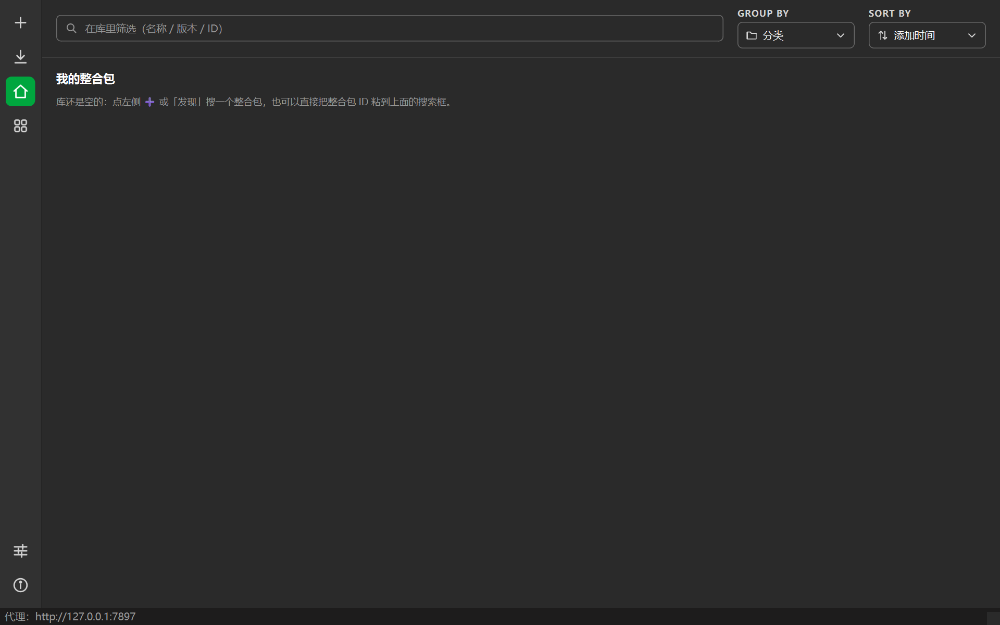
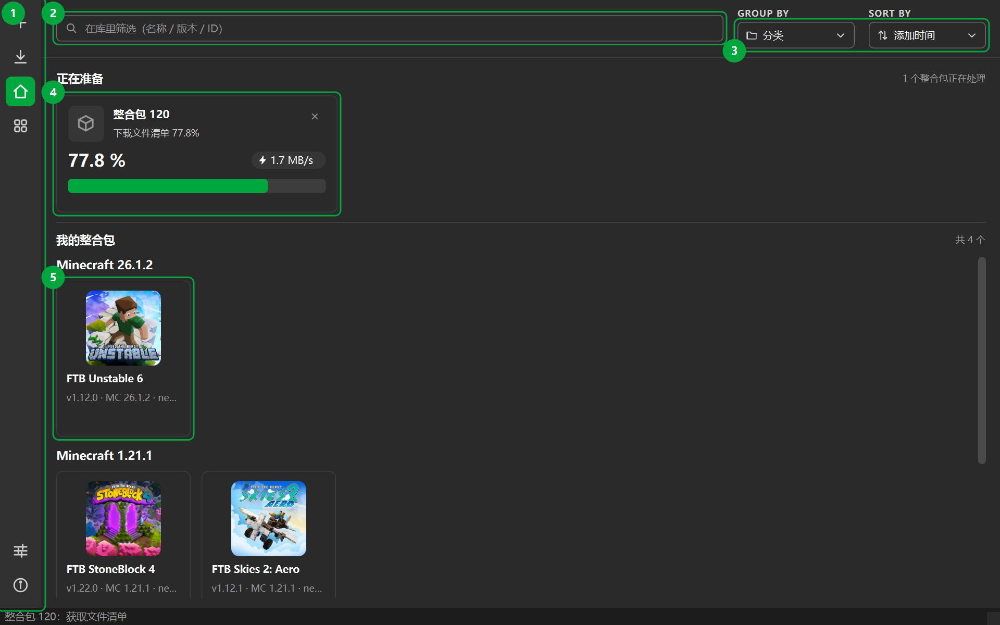
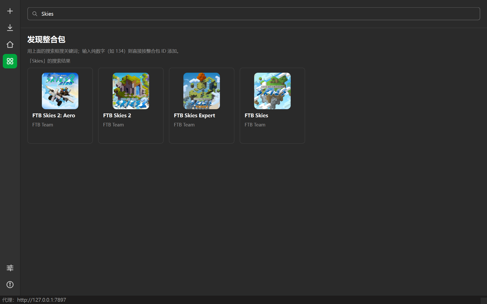
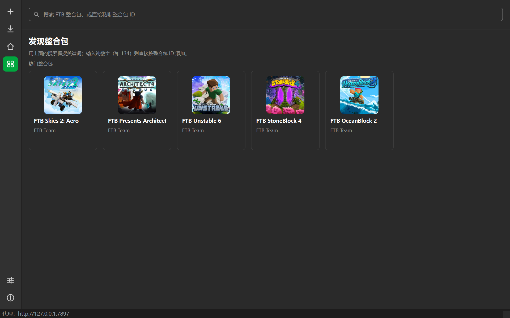
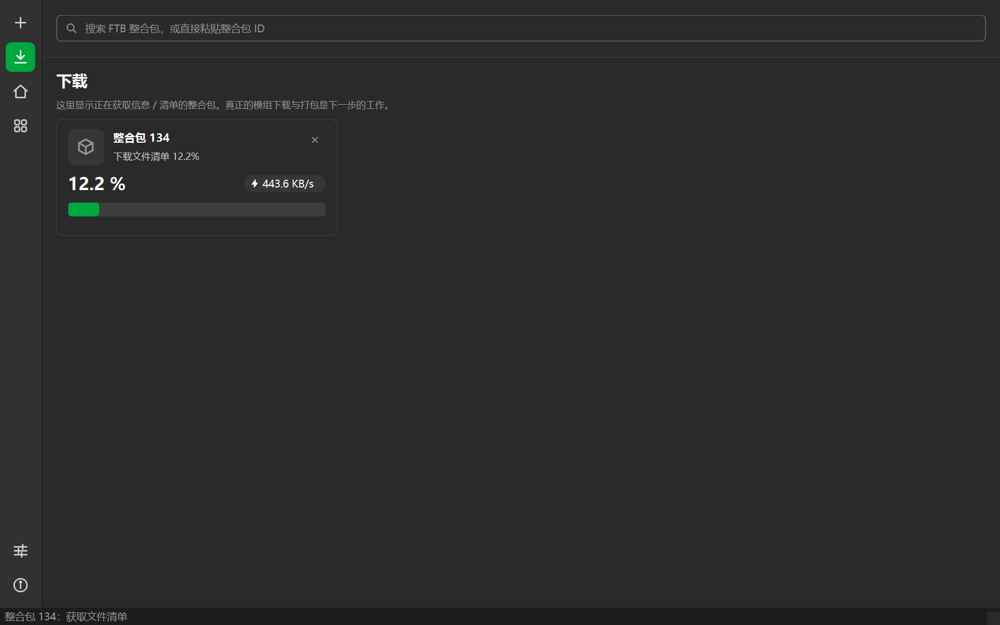
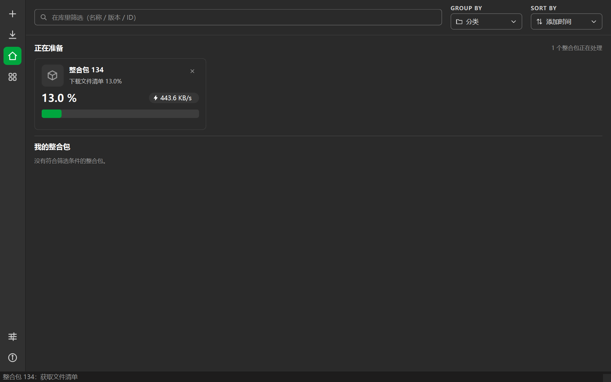
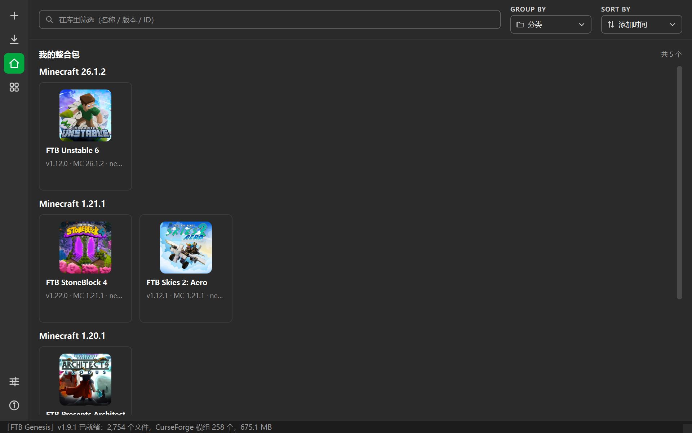
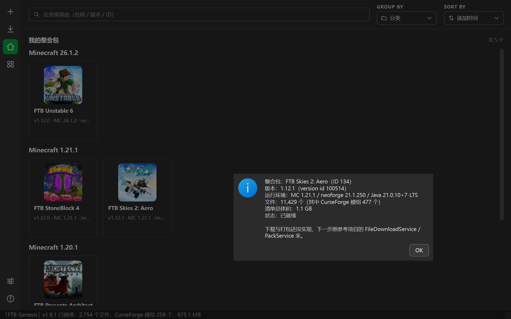
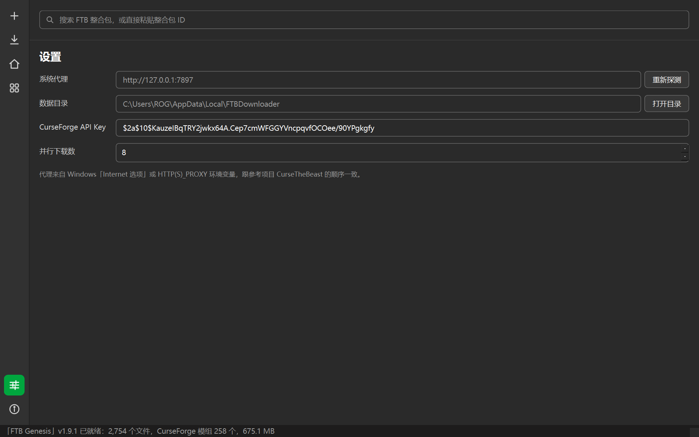

# 使用指导

FTB 整合包下载器（PySide6）从 FTB 官方接口拉取整合包信息与文件清单，最终目标是打包成能直接拖进
启动器安装的 CurseForge 格式整合包。

> ⚠️ **先看一眼当前进度**：现在**还没有**实现「下载模组文件」和「打包 zip」，
> 也就是说这一版能把整合包**信息**准备好（名称 / 版本 / 运行环境 / 文件清单 / CurseForge 模组清单），
> 还**不能**产出能安装的整合包。详见文末[第 8 节](#8-现在还没做的)。

**最短路径**：`uv sync` → `uv run main.py` → 顶部搜索框粘 `134` 回车 → 等清单下完 →
「我的整合包」里就出现了。详细说明往下看。

---

## 1. 运行前准备

| 项目 | 要求 |
| --- | --- |
| 操作系统 | Windows 10 1607 以上 / 主流 Linux |
| Python | 3.10 以上（开发环境用的是 3.14） |
| 包管理器 | [uv](https://docs.astral.sh/uv/) |
| 网络 | 能访问 `api.feed-the-beast.com` 和 `cdn.feed-the-beast.com`（国内建议备好代理） |

```powershell
uv sync          # 建 .venv 并按 uv.lock 装依赖
uv run main.py   # 启动
```

首次启动时库里是空的：



---

## 2. 界面速览



| 编号 | 位置 | 作用 |
| --- | --- | --- |
| ① | 最左侧图标栏 | ＋ 添加 / 下载 / 我的整合包 / 发现 / 设置 / 关于，选中项是绿底 |
| ② | 顶部搜索框 | 在「我的整合包」页是**筛选**；在其它页是**搜索**；输入纯数字回车则**按 ID 添加** |
| ③ | GROUP BY / SORT BY | 只对「我的整合包」生效：按 分类（MC 版本）/ 状态 / 名称分组，按 添加时间 / 名称 / 体积排序 |
| ④ | 正在准备 | 正在获取信息或清单的整合包，带百分比、进度条和实时速度 |
| ⑤ | 我的整合包 | 已经就绪的整合包，一格一个，点开看详情 |

---

## 3. 添加整合包

三种方式，按方便程度排：

### 3.1 直接输 ID（最快）

整合包 ID 就是 FTB 官网地址末尾那串数字：

```
https://www.feed-the-beast.com/modpacks/134
                                          ^^^
```

把 `134` 粘进顶部搜索框回车，就会开始准备。例如：

| 整合包 | ID |
| --- | --- |
| FTB Skies 2: Aero | 134 |
| FTB Presents Architect's Exodus | 127 |
| FTB StoneBlock 4 | 130 |
| FTB Unstable 6 | 132 |

### 3.2 搜关键词

搜索框里输入名称片段（比如 `Skies`）回车，会跳到「发现」页列出结果，**点卡片**即可加入：



### 3.3 从「发现」的热门列表点选

点左侧栏的 **▦ 发现整合包**，会加载当前热门整合包。同样是点卡片加入：



---

## 4. 等待准备完成

添加之后会跑两个阶段：

1. **获取整合包信息** —— 拿名称、版本列表、封面，几秒的事；
2. **获取文件清单** —— 这个清单**很大**（FTB Skies 2: Aero 约 8 MB / 11429 条），
   界面会实时显示百分比和下载速度。

「下载」页和主页的「正在准备」区看到的是同一批任务：



在主页上就是那张大卡片：



拿到清单后会算出文件总数、CurseForge 模组数、总体积和运行环境（MC 版本 / 加载器 / Java），
卡片转入「我的整合包」。失败的话卡片会**变红**并在底部状态栏给出原因。

---

## 5. 管理我的整合包



| 想做的事 | 怎么做 |
| --- | --- |
| 换个分组方式 | 顶栏 GROUP BY：分类（按 MC 版本）/ 状态 / 名称 |
| 换个排序 | 顶栏 SORT BY：添加时间 / 名称（A-Z）/ 体积（大到小） |
| 在库里找 | 在「我的整合包」页用搜索框筛（匹配名称 / 版本 / ID） |
| 看详情 | **左键单击**卡片 |
| 从库里删掉 | **右键单击**卡片 → 从库中移除（会再确认一次；**不会**删已下载的文件） |

单击卡片弹出的详情：



---

## 6. 设置与代理



- **系统代理**：自动读取。顺序和参考项目 CurseTheBeast 一致 ——
  Windows「Internet 选项」里的代理 → `HTTPS_PROXY` / `HTTP_PROXY` 环境变量 → 直连。
  改了代理之后点「重新探测」即可，不用重启。
  底部状态栏一直显示当前用的是哪个代理。
- **数据目录**：库文件的位置，点「打开目录」直接跳过去。
- **CurseForge API Key**：内置了一个公用 Key。CurseForge 的接口就是这么设计的，
  绝大多数相关工具都内置同一个，**正常使用不需要改**。
- **并行下载数**：给下一步的下载器预留的，现在改它没有效果。

命令行想临时指定代理，用环境变量即可：

```powershell
$env:HTTPS_PROXY='http://127.0.0.1:7897'; $env:HTTP_PROXY='http://127.0.0.1:7897'
uv run main.py
```

---

## 7. 数据放在哪

| 平台 | 位置 |
| --- | --- |
| Windows | `%LOCALAPPDATA%\FTBDownloader\library.json` |
| Linux | `~/.local/share/FTBDownloader/library.json` |

里面只记录你添加过哪些整合包、准备到了哪一步。**直接删掉它就等于清空整合包库**。

---

## 8. 现在还没做的

| 待做 | 参考项目里的对应实现 |
| --- | --- |
| 下载队列：多线程、缓存、sha1 校验 | `Services/FileDownloadService.cs`、`Download/DownloadQueue.cs` |
| CurseForge fileId 有效性校验（sha1 对不上就改成自己下载） | `Services/CurseforgeService.cs` |
| 打包成 CurseForge zip（`manifest.json` / `overrides/` / `modlist.html` / 注释 / 图标） | `Packs/CurseforgeModpackExtensions.cs` |
| 服务端包 + loader 预安装（Forge / NeoForge / Fabric） | `Packs/ServerModpack.cs`、`ServerInstaller/*` |
| 失效文件恢复 | `FTBService.TryRecoverUnreachableFiles` |

---

## 9. 常见问题

**报「调用接口失败」/ 一直卡在「获取整合包信息」**
：多半是连不上 FTB。开代理后到设置页点「重新探测」，或者按第 6 节用环境变量指定代理再启动。

**清单下载很慢**
：正常。清单本身就有 8 MB 起，热门大包更久；进度条和速度都是实时的，耐心等。

**库里显示「没有符合筛选条件的整合包」**
：搜索框里还有上次输入的关键词，清空即可。

**中文在控制台里变成乱码**
：Windows 控制台默认不是 UTF-8，先 `chcp 65001`。

**没有显示器 / 想在 CI 里跑一下**
：`QT_QPA_PLATFORM=offscreen uv run main.py --self-test`，只建窗口不进入事件循环。

**想验证接口是不是通的**
：`uv run python scripts\smoke_ftb_api.py`，不弹窗，直接跑一遍 FTB 接口。

---

## 10. 这些截图是怎么来的

本文所有截图由脚本现场生成（**数据是真的**，会去 FTB 接口拉清单；库写到临时目录，不动你自己的库）：

```powershell
uv run python scripts\make_guide_screenshots.py
```

结果输出到 `docs/guide/`。改了界面记得重新跑一遍。
